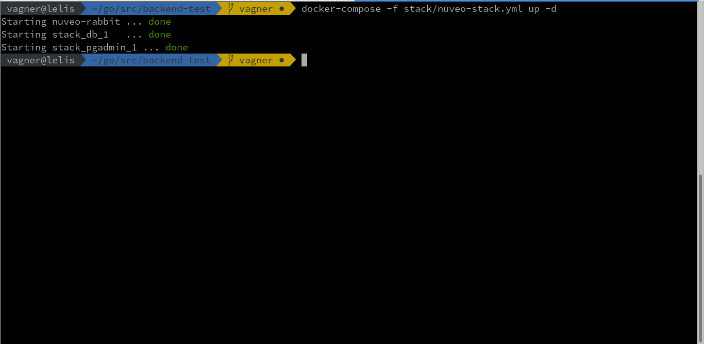
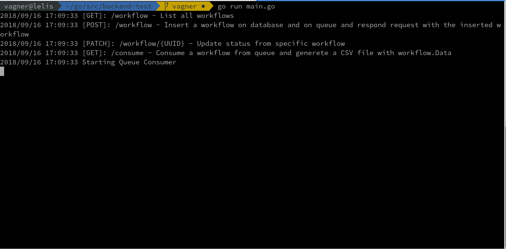

# Backend Test
Develop the workflow's REST API following the specification bellow and document it.

## Delivery instructions

Fork this project in a private project and create a branch. When you want to our review, create a PR and put any information that you think is important. Consider we follow your instructions to run your code and look the outcome.

## Defining a workflow

|Name|Type|Description|
|-|-|-|
|UUID|UUID|workflow unique indentifier|
|status|Enum(inserted, consumed)|workflow status|
|data|JSONB|workflow input|
|steps|Array|name of workflow steps

## Endpoints

|Verb|URL|Description|
|-|-|-|
|POST|/workflow|insert a workflow on database and on queue and respond request with the inserted workflow|
|PATCH|/workflow/{UUID}|update status from specific workflow|
|GET|/workflow|list all workflows|
|GET|/workflow/consume|consume a workflow from queue and generete a CSV file with workflow.Data|

## Technologies

- Go, C or C++
- PostgreSQL
- A message queue that you choose, but discribe why you choose.
- [pREST](http://postgres.rest) to comunicate with database. It is a bonus.

# Solução Proposta

## Infraestruta de desenvolvimento

A solução faz uso da seguinte infraestrutura:
 - Banco de Dados `Postgres`
 - Cliente de banco de dados `PGAdmin4`
 - Sistema de mensageria `Rabbitqm`

Para disponibilizar esse infraestrutura utilizamos
[docker](http://www.docker.com) e ferramenta `docker-compose`. Para maiores
detalhes de como instalar o docker clique
[aqui](https://docs.docker.com/install/).

Primeiro vamos fazer o dowload das imagens e instanciá-las:

```console
docker-compose -f stack/nuveo-stack.yml up -d
```

Caso não ocorra problemas, a seguinete mensagem será exibida no terminal:



Com o contâiner do docker instanciado, vamos criar o banco de dados. Para isso
utilize o cliente de banco de dados de sua preferência ou acesse o `PGAdim4`
através da URL [http://localhost](http://localhost) com o *login*
`admin@nuveo.ai` e *senha* `nuveo`

```sql
CREATE USER nuveo WITH
	LOGIN
	NOSUPERUSER
	NOCREATEDB
	NOCREATEROLE
	INHERIT
	NOREPLICATION
	CONNECTION LIMIT -1
	PASSWORD 'nuveo';

CREATE DATABASE nuveo
    WITH
    OWNER = nuveo
    ENCODING = 'UTF8'
    CONNECTION LIMIT = -1;
```

Com o bando de dados criado, ainda com o superusuário *postgres* conecte ao
banco de dado nuveo e crie o esquema *nuveo* e habilite a extensão `uuid-ossp`
que permite a criação de atributos do tipo UUID.

```sql
CREATE SCHEMA nuveo
    AUTHORIZATION nuveo;

CREATE EXTENSION
    IF NOT EXISTS "uuid-ossp";
```

Nesse momento, já é possível conectar ao banco de dados com o usuário *nuveo* e
criar a tabela de mesmo nome.
```sql
create table nuveo.workflow(workflow_id serial not null,
                            uuid uuid not null,
                            status smallint not null,
                            data jsonb,
                            steps text ARRAY not null
                            );
alter table nuveo.workflow
add constraint pk_workflow
primary key (workflow_id);

alter table nuveo.workflow
add constraint uq_workflow_uuid
unique(uuid);

alter table nuveo.workflow
add constraint chk_workflow_status
check(status = 0 or status = 1);
```

O sistema de mensageria *Rabbitqm* receberá requisições em sua porta padrão
(`5672`).A interface de adminstriação do *Rabbitqm* pode ser acessada pelo
endereço [http://localhost:15672](http://localhost:15672).


Com a infraestrutura criada podemos iniciar a API com o comando:

```console
go run main.go
```

Se nenhum problema for identificado, a seguinte mensagem será exibida
no terminal.



## Inserir dados no Banco de Dados

Para inserir dados de testes no banco de dados criamos um script em Python.
Os dados podem ser inseridos através do comando:

```console
python dummy_data.py
```

## Produzir mensagens para a fila

Para inserir mensagens na fila do sistema de mensageria *Rabbitqm* execute o
`producer.go` disponível na pasta `qm`

```console
cd qm\
go run producer.go
```
